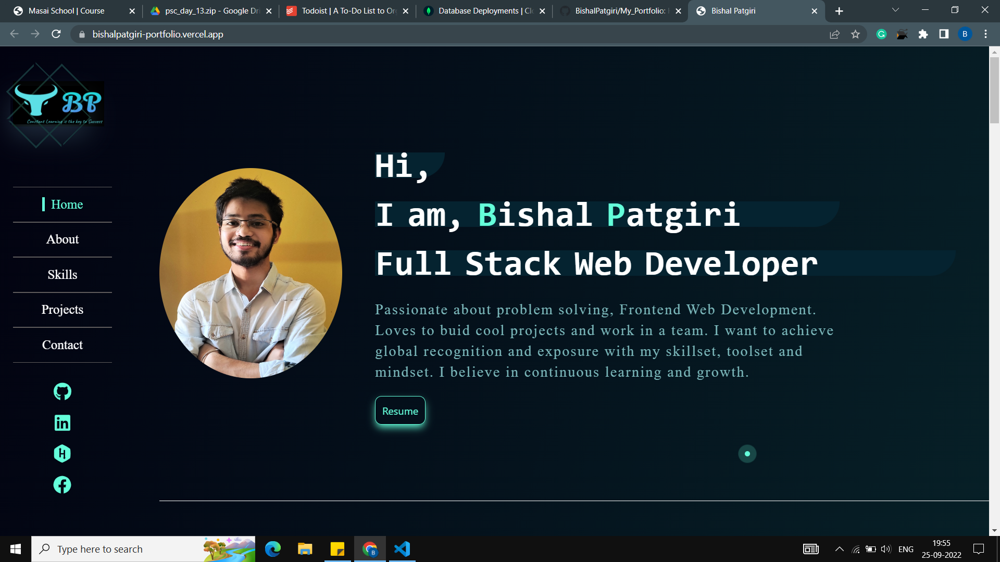

# Bishal_Patgiri_Portfolio
### This project is all about to show my skills, projects, about myself and many more.... I have desigend this by my own by looking at many great portfolios in the web.
There is lot more remaing to make it the best but one day I will make it. This is just the begining.
### Tech Stack used in this project are:
- ReactJS
- CSS
- Different npm packages.

### Features of my portfolio:
- The portfolio I have desigend is fully on ReactJS. 
- I have used the pure CSS in my project, so that I can have full control in the designing part. I have given some good animation using CSS anaimation property.
- This is basically a single page website. 
- It conatins my intro, about, skill, projects and contact me sections.
- By clicking on the navbar items we can go that perticuler section of the website.

## Different sections of my portfolio look like
### The intro section:

## *Hope everyone liked it. If you liked it don't forget to give a star.*
